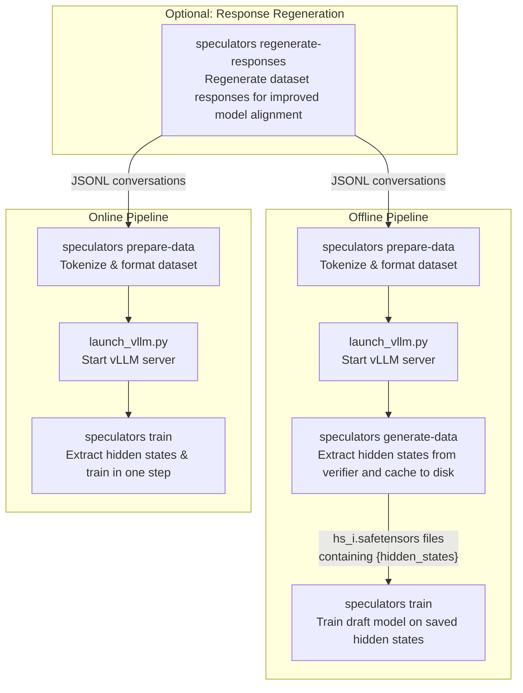

# CLI Reference

This page provides a comprehensive reference for all command-line interface (CLI) tools available in Speculators.

## Overview

Speculators provides the following CLI commands for different stages of the speculative decoding workflow:

| Command                            | Purpose                                                      | Reference                               |
| ---------------------------------- | ------------------------------------------------------------ | --------------------------------------- |
| `speculators prepare-data`         | Preprocess and tokenize datasets for training                | [→ Details](prepare_data.md)            |
| `speculators generate-data`        | Generate hidden states offline using vLLM                    | [→ Details](data_generation_offline.md) |
| `launch_vllm.py`                   | Launch vLLM server configured for hidden states extraction   | [→ Details](launch_vllm.md)             |
| `speculators train`                | Train speculator models with online or offline hidden states | [→ Details](train.md)                   |
| `speculators regenerate-responses` | Regenerate dataset responses using a vLLM-served model       | [→ Details](response_regeneration.md)   |
| `speculators stitch-mtp`           | Stitch finetuned MTP weights back into verifier checkpoint   | `speculators stitch-mtp --help`         |
| `speculators convert`              | Convert speculator checkpoints between formats               | `speculators convert --help`            |

## Common Workflows

The diagram below shows the high-level flow for training a speculator model. The offline pipeline runs each stage sequentially, while the online pipeline combines hidden-state extraction and training into a single step.

